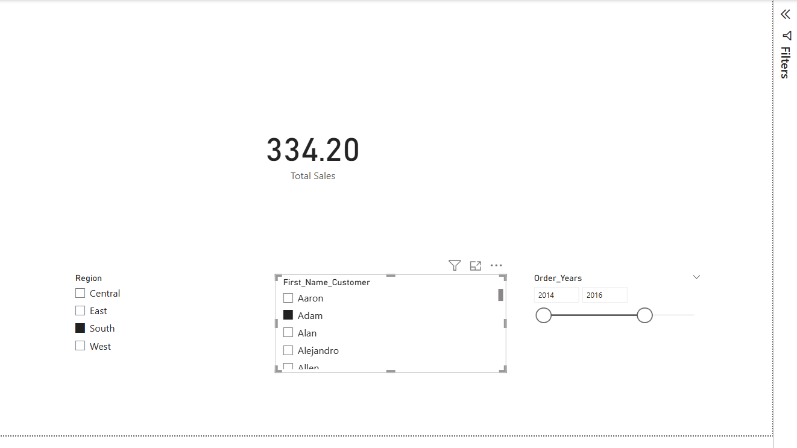
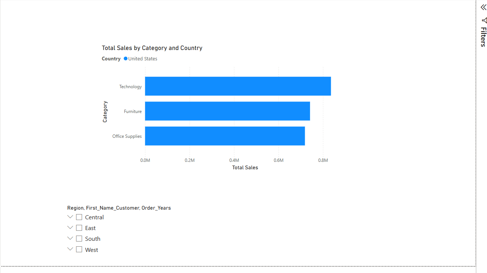
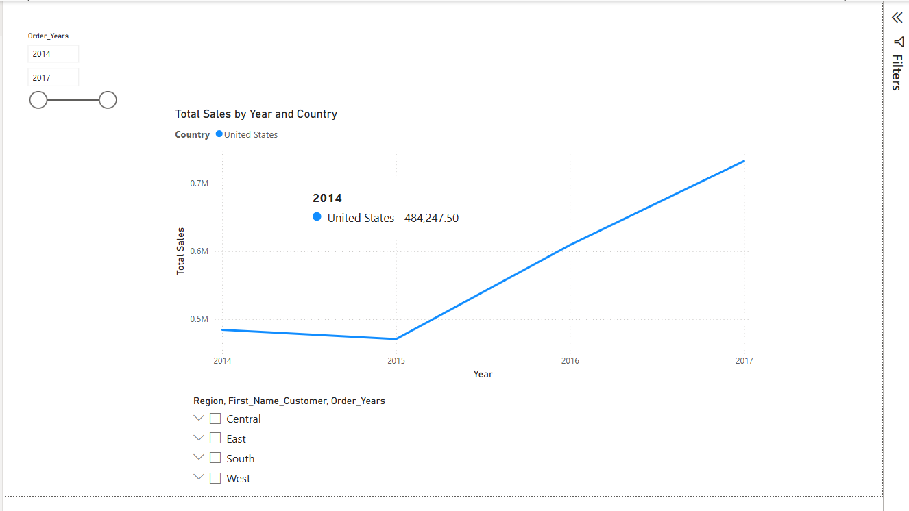
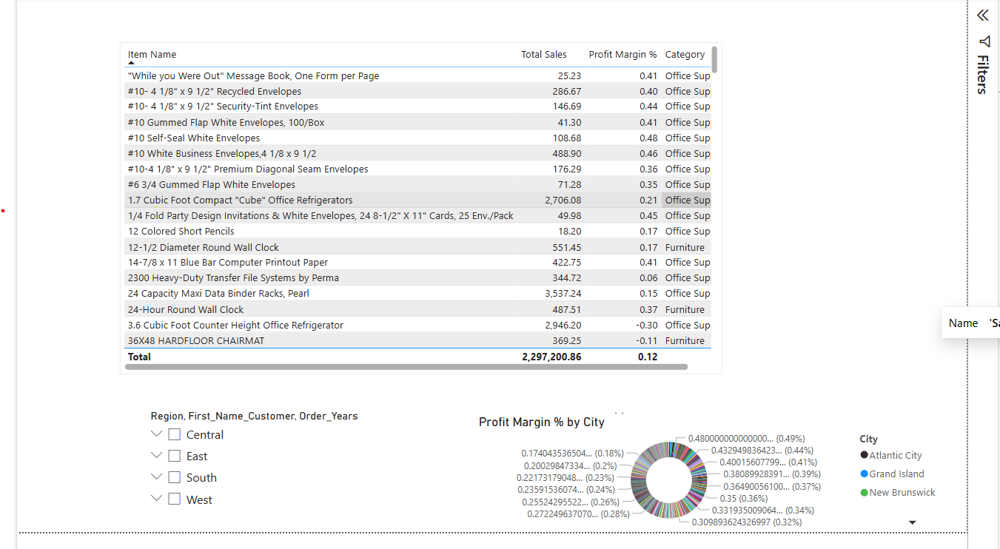

# 📊 Superstore Sales Analysis — Power BI Dashboard

## 🧾 Project Overview
Interactive Power BI dashboard for analyzing sales, profit, and customer trends using the Sample Superstore dataset.

---

## 📷 Dashboard Snapshots

### 🔹 Total Sales KPI + Slicers

### 🔹 Sales by Category Bar Chart

### 🔹 Line Chart – Sales Over Time

### 🔹 Profit Margin Measure + Filtering

### 🔹 Final Interactive Layout with Slicers

---

## 📁 Dataset
- `Sample - Superstore.csv`

---

## 📐 DAX Measures Used

- `Total Sales`
- `Total Profit`
- `Profit Margin %`
- `Avg Discount`
- `Total Discount`

---

## 🎛️ Filters and Slicers

- Year (`Order_Years`)
- Region
- Customer First Name

---

## 📊 Key Visuals

- Cards (KPI)
- Bar chart by category
- Line chart over time
- Pie chart by region
- Table for detailed breakdown

---

## 🚀 How to Use

1. Open `.pbix` file in Power BI Desktop
2. Use slicers to filter views
3. Interact with visuals and explore insights

---

Let me know if you want this full `README.md` exported or want to add a GIF too (for animated preview)!
