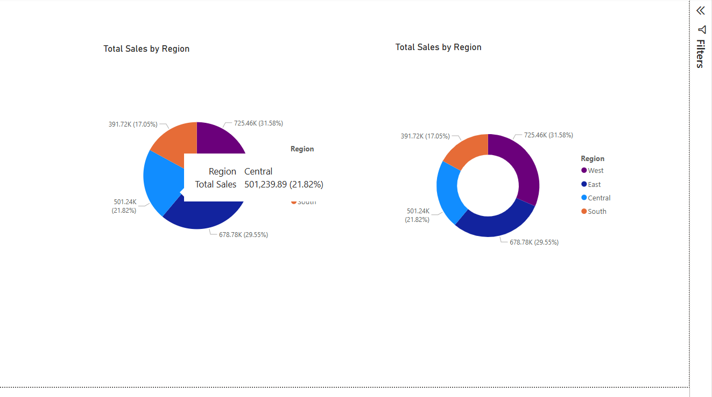

# 📊 Superstore Sales Analysis — Power BI Dashboard

> 🎯 **Business Intelligence Dashboard** created using the **Sample Superstore dataset** to analyze key performance indicators like sales, profit, and discount trends — enhanced with interactivity and clean visual storytelling in **Power BI Desktop**.

---

## 🧾 Project Overview

This project demonstrates how to use **Power BI** to:
- Track and monitor **Total Sales**, **Profit**, and **Discounts**
- Explore customer behavior and category performance
- Build **interactive, filterable dashboards** for decision-making

🛠️ Built with:
- Power BI Desktop
- DAX for custom metrics
- CSV data transformation
- Animated visuals & custom slicers

---

## 🎞️ Dashboard Preview (Snapshots with Animation)

> 🖱️ Hover-enabled animation examples of key visuals

| Visual | Preview |
|--------|---------|
| 🔹 **Total Sales KPI + Slicers** |  |
| 🔹 **Sales by Category – Bar Chart** |  |
| 🔹 **Line Chart – Sales Over Time** |  |
| 🔹 **Profit Margin + Filters** |  |
| 🔹 **Final Interactive Layout** |  |

🌀 *Note: Add GIFs later for smooth transitions, slicer interactivity, and layout toggles*

---

## 📁 Dataset

The dashboard is powered by:
- `Sample - Superstore.csv`

Contains:
- Order data (Dates, Regions, Categories)
- Customer data
- Sales, Profit, and Discount columns

---

## 📐 DAX Measures Used

| Measure Name        | DAX Logic (Simplified)                       |
|---------------------|----------------------------------------------|
| `Total Sales`       | `SUM(Sales)`                                 |
| `Total Profit`      | `SUM(Profit)`                                |
| `Profit Margin %`   | `DIVIDE([Total Profit], [Total Sales])`      |
| `Avg Discount`      | `AVERAGE(Discount)`                          |
| `Total Discount`    | `SUM(Sales * Discount)`                      |

---

## 🎛️ Filters and Slicers

Used for interactive exploration:
- 📅 **Order Year** (via Date slicer)
- 🌍 **Region**
- 👤 **Customer First Name**

Includes both:
- ✔️ Standard slicers
- 🔘 Button slicers for toggling views (with bookmarks)

---

## 📊 Key Visuals & Layouts

- 💳 **Cards** for Total Sales, Profit, Avg Discount
- 📊 **Bar chart**: Sales by Category/Sub-Category
- 📈 **Line chart**: Monthly Sales Trend
- 🧭 **Pie chart**: Regional breakdown
- 📋 **Table**: Transaction-level drilldown
- 🧩 Custom visuals with subtle transitions

---

## 🚀 How to Use

1. 🔓 Open the `.pbix` file in **Power BI Desktop**
2. 🎚️ Use **slicers** and **buttons** to interact
3. 🧠 Hover, drill, and analyze different trends

---

## 📌 Coming Soon

- 🎞️ Animated GIF Preview
- 🌐 Power BI Service Share Link (optional)
- 📥 Sample `.pbix` download

---

## 🙌 Let’s Connect

If you liked this dashboard or need help building your own:
📩 Reach out via [LinkedIn](#) or [GitHub](#)

---
